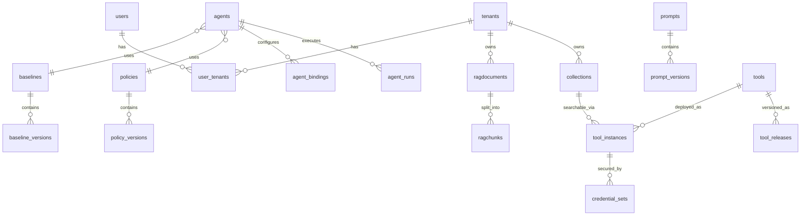

# Схема базы данных ML Portal

## Обзор архитектуры

База данных использует PostgreSQL с UUID первичными ключами и JSONB для гибких конфигураций. Основные паттерны:
- **Scope-based isolation**: Default → Tenant → User для политик и кредов
- **Versioning**: Промпты, базлайны и политики поддерживают версионирование
- **Audit trails**: Все изменения отслеживаются через created_at/updated_at
- **Soft deletes**: Активность контролируется через is_active флаги

---

## Core Entities

### Users & Tenants (Мультитенантность)

#### `users`
```sql
CREATE TABLE users (
    id UUID PRIMARY KEY DEFAULT gen_random_uuid(),
    login VARCHAR(255) UNIQUE NOT NULL,
    password_hash TEXT NOT NULL,
    email VARCHAR(255),
    role VARCHAR(20) DEFAULT 'reader',
    is_active BOOLEAN DEFAULT true,
    require_password_change BOOLEAN DEFAULT false,
    created_at TIMESTAMPTZ DEFAULT now(),
    updated_at TIMESTAMPTZ DEFAULT now()
);
```

#### `tenants`
```sql
CREATE TABLE tenants (
    id UUID PRIMARY KEY DEFAULT gen_random_uuid(),
    name VARCHAR UNIQUE,
    description VARCHAR(500),
    is_active BOOLEAN DEFAULT true,
    embedding_model_alias VARCHAR(100) REFERENCES models(alias),
    ocr BOOLEAN DEFAULT false,
    layout BOOLEAN DEFAULT false,
    created_at TIMESTAMPTZ DEFAULT now(),
    updated_at TIMESTAMPTZ DEFAULT now()
);
```

#### `user_tenants` (Many-to-Many)
```sql
CREATE TABLE user_tenants (
    id UUID PRIMARY KEY DEFAULT gen_random_uuid(),
    user_id UUID REFERENCES users(id),
    tenant_id UUID REFERENCES tenants(id),
    is_default BOOLEAN DEFAULT false
);
```

---

## Agent System

### `agents` (Профили агентов)
```sql
CREATE TABLE agents (
    id UUID PRIMARY KEY DEFAULT gen_random_uuid(),
    slug VARCHAR(255) UNIQUE NOT NULL,
    name VARCHAR(255) NOT NULL,
    description TEXT,
    system_prompt_slug VARCHAR(255) NOT NULL,  -- Ссылка на prompts.slug
    baseline_id UUID REFERENCES baselines(id),
    policy_id UUID REFERENCES policies(id),
    capabilities JSONB DEFAULT '[]',  -- ["knowledge_base_search", "ticket_management"]
    supports_partial_mode BOOLEAN DEFAULT false,
    generation_config JSONB DEFAULT '{}',  -- temperature, max_tokens, etc.
    is_active BOOLEAN DEFAULT true,
    enable_logging BOOLEAN DEFAULT true,
    created_at TIMESTAMPTZ DEFAULT now(),
    updated_at TIMESTAMPTZ DEFAULT now()
);
```

### `agent_bindings` (Привязки инструментов)
```sql
CREATE TABLE agent_bindings (
    id UUID PRIMARY KEY DEFAULT gen_random_uuid(),
    agent_id UUID REFERENCES agents(id) ON DELETE CASCADE,
    tool_id UUID REFERENCES tools(id),
    tool_instance_id UUID REFERENCES tool_instances(id),
    credential_strategy VARCHAR(20) DEFAULT 'instance',  -- instance | user | tenant
    is_required BOOLEAN DEFAULT false,
    is_recommended BOOLEAN DEFAULT false,
    config JSONB DEFAULT '{}',
    created_at TIMESTAMPTZ DEFAULT now(),
    updated_at TIMESTAMPTZ DEFAULT now()
);
```

### `agent_runs` (Логи выполнения)
```sql
CREATE TABLE agent_runs (
    id UUID PRIMARY KEY DEFAULT gen_random_uuid(),
    agent_id UUID REFERENCES agents(id),
    user_id UUID REFERENCES users(id),
    tenant_id UUID REFERENCES tenants(id),
    chat_id UUID,
    status VARCHAR(20) DEFAULT 'running',
    input_tokens INTEGER DEFAULT 0,
    output_tokens INTEGER DEFAULT 0,
    total_cost_cents INTEGER DEFAULT 0,
    duration_ms INTEGER,
    error_message TEXT,
    metadata JSONB DEFAULT '{}',
    started_at TIMESTAMPTZ DEFAULT now(),
    completed_at TIMESTAMPTZ
);
```

### `agent_run_steps` (Шаги выполнения)
```sql
CREATE TABLE agent_run_steps (
    id UUID PRIMARY KEY DEFAULT gen_random_uuid(),
    run_id UUID REFERENCES agent_runs(id) ON DELETE CASCADE,
    step_type VARCHAR(50),  -- llm_call, tool_call, tool_result
    step_order INTEGER NOT NULL,
    input_data JSONB,
    output_data JSONB,
    duration_ms INTEGER,
    error_message TEXT,
    created_at TIMESTAMPTZ DEFAULT now()
);
```

---

## Versioning System

### Prompts (Системные промпты)

#### `prompts` (Контейнеры)
```sql
CREATE TABLE prompts (
    id UUID PRIMARY KEY DEFAULT gen_random_uuid(),
    slug VARCHAR(255) UNIQUE NOT NULL,  -- "chat.rag.system", "agent.netbox.config_gen"
    name VARCHAR(255) NOT NULL,
    description TEXT,
    type VARCHAR(50) DEFAULT 'prompt',  -- prompt | baseline
    recommended_version_id UUID REFERENCES prompt_versions(id),
    created_at TIMESTAMPTZ DEFAULT now(),
    updated_at TIMESTAMPTZ DEFAULT now()
);
```

#### `prompt_versions` (Версии)
```sql
CREATE TABLE prompt_versions (
    id UUID PRIMARY KEY DEFAULT gen_random_uuid(),
    prompt_id UUID REFERENCES prompts(id) ON DELETE CASCADE,
    template TEXT NOT NULL,  -- Jinja2 шаблон
    input_variables JSONB DEFAULT '[]',  -- ["query", "context"]
    generation_config JSONB DEFAULT '{}',
    version INTEGER NOT NULL,
    status VARCHAR(20) DEFAULT 'draft',  -- draft | active | archived
    parent_version_id UUID REFERENCES prompt_versions(id),
    created_at TIMESTAMPTZ DEFAULT now(),
    updated_at TIMESTAMPTZ DEFAULT now(),
    UNIQUE(prompt_id, version)
);
```

### Baselines (Ограничения и правила)

#### `baselines` (Контейнеры)
```sql
CREATE TABLE baselines (
    id UUID PRIMARY KEY DEFAULT gen_random_uuid(),
    slug VARCHAR(255) UNIQUE NOT NULL,
    name VARCHAR(255) NOT NULL,
    description TEXT,
    scope VARCHAR(20) DEFAULT 'default',  -- default | tenant | user
    tenant_id UUID REFERENCES tenants(id),
    user_id UUID REFERENCES users(id),
    is_active BOOLEAN DEFAULT true,
    recommended_version_id UUID REFERENCES baseline_versions(id),
    created_at TIMESTAMPTZ DEFAULT now(),
    updated_at TIMESTAMPTZ DEFAULT now()
);
```

#### `baseline_versions` (Версии)
```sql
CREATE TABLE baseline_versions (
    id UUID PRIMARY KEY DEFAULT gen_random_uuid(),
    baseline_id UUID REFERENCES baselines(id) ON DELETE CASCADE,
    template TEXT NOT NULL,
    version INTEGER NOT NULL,
    status VARCHAR(20) DEFAULT 'draft',  -- draft | active | archived
    parent_version_id UUID REFERENCES baseline_versions(id),
    notes TEXT,
    created_at TIMESTAMPTZ DEFAULT now(),
    updated_at TIMESTAMPTZ DEFAULT now(),
    UNIQUE(baseline_id, version)
);
```

### Policies (Лимиты выполнения)

#### `policies` (Контейнеры)
```sql
CREATE TABLE policies (
    id UUID PRIMARY KEY DEFAULT gen_random_uuid(),
    slug VARCHAR(255) UNIQUE NOT NULL,
    name VARCHAR(255) NOT NULL,
    description TEXT,
    recommended_version_id UUID REFERENCES policy_versions(id),
    is_active BOOLEAN DEFAULT true,
    created_at TIMESTAMPTZ DEFAULT now(),
    updated_at TIMESTAMPTZ DEFAULT now()
);
```

#### `policy_versions` (Версии)
```sql
CREATE TABLE policy_versions (
    id UUID PRIMARY KEY DEFAULT gen_random_uuid(),
    policy_id UUID REFERENCES policies(id) ON DELETE CASCADE,
    version INTEGER NOT NULL,
    status VARCHAR(20) DEFAULT 'draft',  -- draft | active | inactive
    
    -- Execution limits
    max_steps INTEGER,
    max_tool_calls INTEGER,
    max_wall_time_ms INTEGER,
    
    -- Tool execution
    tool_timeout_ms INTEGER,
    max_retries INTEGER,
    
    -- Budget limits
    budget_tokens INTEGER,
    budget_cost_cents INTEGER,
    
    -- Extended configuration
    extra_config JSONB DEFAULT '{}',
    parent_version_id UUID REFERENCES policy_versions(id),
    notes TEXT,
    created_at TIMESTAMPTZ DEFAULT now(),
    updated_at TIMESTAMPTZ DEFAULT now(),
    UNIQUE(policy_id, version)
);
```

---

## Tool System

### `tool_groups` (Группы инструментов)
```sql
CREATE TABLE tool_groups (
    id UUID PRIMARY KEY DEFAULT gen_random_uuid(),
    slug VARCHAR(100) UNIQUE NOT NULL,  -- "jira", "rag", "netbox"
    name VARCHAR(255) NOT NULL,
    description TEXT,
    is_active BOOLEAN DEFAULT true,
    created_at TIMESTAMPTZ DEFAULT now(),
    updated_at TIMESTAMPTZ DEFAULT now()
);
```

### `tools` (Реестр инструментов)
```sql
CREATE TABLE tools (
    id UUID PRIMARY KEY DEFAULT gen_random_uuid(),
    slug VARCHAR(255) UNIQUE NOT NULL,  -- "jira.search", "rag.search"
    tool_group_id UUID REFERENCES tool_groups(id) ON DELETE CASCADE,
    name VARCHAR(255) NOT NULL,
    name_for_llm VARCHAR(255),
    description TEXT,
    type VARCHAR(50) DEFAULT 'builtin',  -- builtin | api | function | database
    input_schema JSONB DEFAULT '{}',
    output_schema JSONB,
    config JSONB DEFAULT '{}',  -- HTTP URL, method, timeout, function_path
    recommended_release_id UUID REFERENCES tool_releases(id),
    is_active BOOLEAN DEFAULT true,
    created_at TIMESTAMPTZ DEFAULT now(),
    updated_at TIMESTAMPTZ DEFAULT now()
);
```

### `tool_backend_releases` (Версии из кода)
```sql
CREATE TABLE tool_backend_releases (
    id UUID PRIMARY KEY DEFAULT gen_random_uuid(),
    tool_id UUID REFERENCES tools(id) ON DELETE CASCADE,
    version VARCHAR(50) NOT NULL,  -- "1.0.0", "1.1.0"
    status VARCHAR(20) DEFAULT 'active',  -- active | deprecated
    input_schema JSONB DEFAULT '{}',
    output_schema JSONB,
    config JSONB DEFAULT '{}',
    metadata JSONB DEFAULT '{}',
    created_at TIMESTAMPTZ DEFAULT now()
);
```

### `tool_releases` (Версии для агентов)
```sql
CREATE TABLE tool_releases (
    id UUID PRIMARY KEY DEFAULT gen_random_uuid(),
    tool_id UUID REFERENCES tools(id) ON DELETE CASCADE,
    backend_release_id UUID REFERENCES tool_backend_releases(id),
    version VARCHAR(50) NOT NULL,
    status VARCHAR(20) DEFAULT 'draft',  -- draft | active | deprecated
    config_overrides JSONB DEFAULT '{}',
    release_notes TEXT,
    created_at TIMESTAMPTZ DEFAULT now(),
    updated_at TIMESTAMPTZ DEFAULT now()
);
```

### `tool_instances` (Инстансы инструментов)
```sql
CREATE TABLE tool_instances (
    id UUID PRIMARY KEY DEFAULT gen_random_uuid(),
    tool_id UUID REFERENCES tools(id) ON DELETE CASCADE,
    name VARCHAR(255) NOT NULL,
    description TEXT,
    instance_type VARCHAR(20) DEFAULT 'shared',  -- shared | dedicated
    health_status VARCHAR(20) DEFAULT 'unknown',  -- healthy | unhealthy | unknown
    config JSONB DEFAULT '{}',  -- URL, credentials reference, etc.
    is_active BOOLEAN DEFAULT true,
    created_at TIMESTAMPTZ DEFAULT now(),
    updated_at TIMESTAMPTZ DEFAULT now()
);
```

---

## Permission System

### `permission_sets` (Наборы прав)
```sql
CREATE TABLE permission_sets (
    id UUID PRIMARY KEY DEFAULT gen_random_uuid(),
    scope VARCHAR(20) NOT NULL,  -- default | tenant | user
    tenant_id UUID REFERENCES tenants(id),
    user_id UUID REFERENCES users(id),
    permissions JSONB DEFAULT '{}',  -- {"tools": ["rag.search"], "collections": ["tickets"]}
    is_active BOOLEAN DEFAULT true,
    created_at TIMESTAMPTZ DEFAULT now(),
    updated_at TIMESTAMPTZ DEFAULT now()
);
```

### `credential_sets` (Наборы кредов)
```sql
CREATE TABLE credential_sets (
    id UUID PRIMARY KEY DEFAULT gen_random_uuid(),
    tool_instance_id UUID REFERENCES tool_instances(id) ON DELETE CASCADE,
    scope VARCHAR(20) NOT NULL,  -- default | tenant | user
    tenant_id UUID REFERENCES tenants(id),
    user_id UUID REFERENCES users(id),
    auth_type VARCHAR(50) NOT NULL,  -- token | basic | oauth | api_key
    encrypted_payload TEXT NOT NULL,  -- Зашифрованные креды
    is_active BOOLEAN DEFAULT true,
    is_default BOOLEAN DEFAULT false,
    created_at TIMESTAMPTZ DEFAULT now(),
    updated_at TIMESTAMPTZ DEFAULT now()
);
```

### `routing_logs` (Логи маршрутизации)
```sql
CREATE TABLE routing_logs (
    id UUID PRIMARY KEY DEFAULT gen_random_uuid(),
    agent_id UUID REFERENCES agents(id),
    user_id UUID REFERENCES users(id),
    tenant_id UUID REFERENCES tenants(id),
    execution_mode VARCHAR(20),  -- full | partial | unavailable
    routing_decision JSONB,  -- Детали решения
    missing_tools JSONB,  -- Отсутствующие инструменты
    created_at TIMESTAMPTZ DEFAULT now()
);
```

---

## RAG System

### `ragdocuments` (Документы)
```sql
CREATE TABLE ragdocuments (
    id UUID PRIMARY KEY DEFAULT gen_random_uuid(),
    tenant_id UUID REFERENCES tenants(id),
    uploaded_by UUID REFERENCES users(id),
    user_id UUID NOT NULL,  -- Required per migration
    name TEXT,
    filename VARCHAR(255) NOT NULL,
    title VARCHAR(255) NOT NULL,
    status VARCHAR(20) DEFAULT 'uploaded',  -- uploaded | processing | ready | failed
    scope VARCHAR(20) DEFAULT 'local',  -- local | global
    content_type VARCHAR(100),
    source_mime VARCHAR(255),
    size INTEGER,
    size_bytes BIGINT,
    s3_key_raw VARCHAR(500),
    s3_key_processed VARCHAR(500),
    url_file TEXT,
    url_canonical_file TEXT,
    tags TEXT[],
    error TEXT,
    error_message TEXT,
    global_version INTEGER,
    date_upload TIMESTAMPTZ DEFAULT now(),
    created_at TIMESTAMPTZ DEFAULT now(),
    updated_at TIMESTAMPTZ,
    processed_at TIMESTAMPTZ,
    
    -- Aggregate status fields
    agg_status VARCHAR(20),
    agg_details_json JSONB
);
```

### `ragchunks` (Чанки документов)
```sql
CREATE TABLE ragchunks (
    id UUID PRIMARY KEY DEFAULT gen_random_uuid(),
    document_id UUID REFERENCES ragdocuments(id) ON DELETE CASCADE,
    chunk_idx INTEGER NOT NULL,
    text TEXT NOT NULL,
    embedding_model VARCHAR(255),
    embedding_version VARCHAR(255),
    date_embedding TIMESTAMPTZ,
    meta TEXT,  -- JSON string
    qdrant_point_id UUID
);
```

---

## Collections (Динамические коллекции)

### `collections` (Метаданные коллекций)
```sql
CREATE TABLE collections (
    id UUID PRIMARY KEY DEFAULT gen_random_uuid(),
    tenant_id UUID REFERENCES tenants(id),
    slug VARCHAR(100) NOT NULL,
    name VARCHAR(255) NOT NULL,
    description TEXT,
    fields JSONB NOT NULL,  -- Схема полей
    row_count INTEGER DEFAULT 0,
    table_name VARCHAR(100) NOT NULL,
    
    -- Vector search
    vector_config JSONB,
    qdrant_collection_name VARCHAR(200),
    total_rows INTEGER DEFAULT 0,
    vectorized_rows INTEGER DEFAULT 0,
    total_chunks INTEGER DEFAULT 0,
    failed_rows INTEGER DEFAULT 0,
    
    -- Configuration
    primary_key_field VARCHAR(100) DEFAULT 'id',
    time_column VARCHAR(100),
    default_sort JSONB,  -- {"field": "created_at", "order": "desc"}
    entity_type VARCHAR(100),  -- "ticket", "device", "user"
    
    -- Guardrails
    allow_unfiltered_search BOOLEAN DEFAULT false,
    max_limit INTEGER DEFAULT 100,
    query_timeout_seconds INTEGER DEFAULT 10,
    
    tool_instance_id UUID REFERENCES tool_instances(id),
    is_active BOOLEAN DEFAULT true,
    created_at TIMESTAMPTZ DEFAULT now(),
    updated_at TIMESTAMPTZ DEFAULT now()
);
```

---

## Model Registry

### `models` (Реестр моделей)
```sql
CREATE TABLE models (
    id UUID PRIMARY KEY DEFAULT gen_random_uuid(),
    alias VARCHAR(100) UNIQUE NOT NULL,  -- "gpt-4", "embedding-v3"
    name VARCHAR(255) NOT NULL,
    type VARCHAR(50) NOT NULL,  -- chat | embedding | image
    status VARCHAR(20) DEFAULT 'active',  -- active | inactive
    provider VARCHAR(100),  -- openai, anthropic, local
    model_config JSONB DEFAULT '{}',  -- model-specific config
    extra_config JSONB DEFAULT '{}',  -- vector_dim, etc.
    is_default_for_type BOOLEAN DEFAULT false,
    created_at TIMESTAMPTZ DEFAULT now(),
    updated_at TIMESTAMPTZ DEFAULT now()
);
```

---

## Chat System

### `chats` (Чаты)
```sql
CREATE TABLE chats (
    id UUID PRIMARY KEY DEFAULT gen_random_uuid(),
    user_id UUID REFERENCES users(id),
    tenant_id UUID REFERENCES tenants(id),
    agent_id UUID REFERENCES agents(id),
    title VARCHAR(255),
    status VARCHAR(20) DEFAULT 'active',
    metadata JSONB DEFAULT '{}',
    created_at TIMESTAMPTZ DEFAULT now(),
    updated_at TIMESTAMPTZ DEFAULT now()
);
```

### `chat_messages` (Сообщения)
```sql
CREATE TABLE chat_messages (
    id UUID PRIMARY KEY DEFAULT gen_random_uuid(),
    chat_id UUID REFERENCES chats(id) ON DELETE CASCADE,
    role VARCHAR(20) NOT NULL,  -- user | assistant | system
    content TEXT NOT NULL,
    token_count INTEGER,
    metadata JSONB DEFAULT '{}',
    created_at TIMESTAMPTZ DEFAULT now()
);
```

---

## Authentication & Audit

### `api_keys` (API ключи)
```sql
CREATE TABLE api_keys (
    id UUID PRIMARY KEY DEFAULT gen_random_uuid(),
    name VARCHAR(255) NOT NULL,
    key_hash VARCHAR(255) UNIQUE NOT NULL,
    user_id UUID REFERENCES users(id),
    tenant_id UUID REFERENCES tenants(id),
    is_active BOOLEAN DEFAULT true,
    expires_at TIMESTAMPTZ,
    last_used_at TIMESTAMPTZ,
    created_at TIMESTAMPTZ DEFAULT now(),
    updated_at TIMESTAMPTZ DEFAULT now()
);
```

### `api_tokens` (Токены доступа)
```sql
CREATE TABLE api_tokens (
    id UUID PRIMARY KEY DEFAULT gen_random_uuid(),
    token_hash VARCHAR(255) UNIQUE NOT NULL,
    user_id UUID REFERENCES users(id),
    tenant_id UUID REFERENCES tenants(id),
    expires_at TIMESTAMPTZ,
    is_revoked BOOLEAN DEFAULT false,
    created_at TIMESTAMPTZ DEFAULT now()
);
```

### `audit_logs` (Аудит логи)
```sql
CREATE TABLE audit_logs (
    id UUID PRIMARY KEY DEFAULT gen_random_uuid(),
    user_id UUID REFERENCES users(id),
    tenant_id UUID REFERENCES tenants(id),
    action VARCHAR(100) NOT NULL,
    resource_type VARCHAR(100),
    resource_id UUID,
    request_data JSONB,
    response_data JSONB,
    ip_address INET,
    user_agent TEXT,
    duration_ms INTEGER,
    status_code INTEGER,
    created_at TIMESTAMPTZ DEFAULT now()
);
```

---

## Event System

### `event_outbox` (Очередь событий)
```sql
CREATE TABLE event_outbox (
    id UUID PRIMARY KEY DEFAULT gen_random_uuid(),
    event_type VARCHAR(100) NOT NULL,
    aggregate_id UUID,
    aggregate_type VARCHAR(100),
    event_data JSONB NOT NULL,
    metadata JSONB DEFAULT '{}',
    status VARCHAR(20) DEFAULT 'pending',  -- pending | processed | failed
    attempts INTEGER DEFAULT 0,
    next_attempt_at TIMESTAMPTZ,
    created_at TIMESTAMPTZ DEFAULT now(),
    processed_at TIMESTAMPTZ
);
```

---

## Key Relationships



---

## Indexes (Основные)

```sql
-- Users & Tenants
CREATE INDEX ix_users_login ON users(login);
CREATE INDEX ix_tenants_name ON tenants(name);

-- Agents
CREATE INDEX ix_agents_slug ON agents(slug);
CREATE INDEX ix_agents_system_prompt_slug ON agents(system_prompt_slug);
CREATE INDEX ix_agents_baseline_id ON agents(baseline_id);
CREATE INDEX ix_agents_policy_id ON agents(policy_id);

-- Versioning
CREATE INDEX ix_prompt_versions_prompt_id ON prompt_versions(prompt_id);
CREATE INDEX ix_prompt_versions_status ON prompt_versions(status);
CREATE INDEX ix_baseline_versions_baseline_id ON baseline_versions(baseline_id);
CREATE INDEX ix_policy_versions_policy_id ON policy_versions(policy_id);

-- Tools
CREATE INDEX ix_tools_slug ON tools(slug);
CREATE INDEX ix_tools_tool_group_id ON tools(tool_group_id);

-- RAG
CREATE INDEX ix_ragdocuments_tenant_id ON ragdocuments(tenant_id);
CREATE INDEX ix_ragdocuments_status ON ragdocuments(status);
CREATE INDEX ix_ragchunks_document_id ON ragchunks(document_id);

-- Collections
CREATE INDEX ix_collections_tenant_id ON collections(tenant_id);
CREATE INDEX ix_collections_slug ON collections(tenant_id, slug);

-- Audit & Logs
CREATE INDEX ix_audit_logs_user_id ON audit_logs(user_id);
CREATE INDEX ix_audit_logs_created_at ON audit_logs(created_at);
CREATE INDEX ix_agent_runs_agent_id ON agent_runs(agent_id);
CREATE INDEX ix_agent_runs_user_id ON agent_runs(user_id);
```

---

## Constraints & Checks

```sql
-- Scope validation
ALTER TABLE baselines ADD CONSTRAINT baselines_scope_check 
    CHECK (scope IN ('default', 'tenant', 'user'));

ALTER TABLE permission_sets ADD CONSTRAINT permission_sets_scope_check 
    CHECK (scope IN ('default', 'tenant', 'user'));

ALTER TABLE credential_sets ADD CONSTRAINT credential_sets_scope_check 
    CHECK (scope IN ('default', 'tenant', 'user'));

-- Status validation
ALTER TABLE prompt_versions ADD CONSTRAINT prompt_versions_status_check 
    CHECK (status IN ('draft', 'active', 'archived'));

ALTER TABLE baseline_versions ADD CONSTRAINT baseline_versions_status_check 
    CHECK (status IN ('draft', 'active', 'archived'));

ALTER TABLE policy_versions ADD CONSTRAINT policy_versions_status_check 
    CHECK (status IN ('draft', 'active', 'inactive'));

-- Document status
ALTER TABLE ragdocuments ADD CONSTRAINT ragdocuments_status_check 
    CHECK (status IN ('uploaded', 'uploading', 'processing', 'processed', 'ready', 'failed', 'archived', 'queued'));
```

---

## Data Flow Patterns

### 1. Agent Execution Flow
```
Agent → AgentRun → AgentRunSteps
  ↓
SystemPrompt (via slug) + Baseline + Policy
  ↓
ToolBindings → ToolInstances + CredentialSets
  ↓
RoutingLog (decision tracking)
```

### 2. Version Resolution
```
Container (prompt/baseline/policy)
  ↓
recommended_version_id → Version (active)
  ↓
Fallback to latest draft if no active
```

### 3. Scope Resolution Priority
```
User > Tenant > Default
```

### 4. RAG Processing Pipeline
```
Document Upload → Processing → Chunking → Embedding → Vector Store
  ↓
Status tracking via agg_status/agg_details_json
```

---

## Security Notes

1. **Encryption**: CredentialSets хранят зашифрованные данные
2. **Isolation**: Tenant-level изоляция данных через tenant_id
3. **Audit**: Все действия логируются в audit_logs
4. **Authentication**: JWT токены + API ключи с истечением
5. **Authorization**: RBAC через PermissionSets с scope-based приоритетом

---

## Performance Considerations

1. **JSONB**: Используется для гибких конфигураций, индексируется через GIN
2. **UUID**: Первичные ключи для распределенной системы
3. **Timezone**: Все временные поля с timezone для глобальной системы
4. **Soft deletes**: Через is_active флаги для сохранения истории
5. **Partitioning**: Возможно для больших таблиц (audit_logs, agent_runs)
