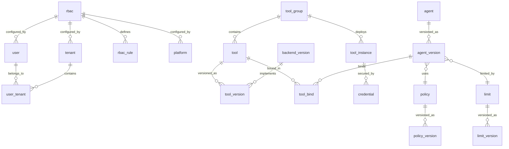

 # Схема базы данных ML Portal v2.0 - Agents & RBAC

## Общие договорённости по типам

```sql
-- ID: bigserial (auto-increment integer)
id UUID PRIMARY KEY

-- Время: всегда с timezone
created_at timestamptz NOT NULL DEFAULT now()
updated_at timestamptz NOT NULL DEFAULT now() -- опционально

-- Slug: case-insensitive если возможно
slug text -- или citext для case-insensitive

-- Хеши и конфигурации
hash text
json jsonb

-- Enum'ы как text + CHECK
version_status: draft|active|deprecated
tool_kind: read|write|mixed
rbac_level: platform|tenant|user
resource_type: agent|toolgroup|tool|instance
effect: allow|deny
credential_strategy: USER_ONLY|TENANT_ONLY|PLATFORM_ONLY|USER_THEN_TENANT|TENANT_THEN_PLATFORM|ANY
```

---

## Core Entities

### 1. Tenant (Организация)
```sql
CREATE TABLE tenant (
    id bigserial PRIMARY KEY,
    name text NOT NULL,
    description text,
    is_active boolean NOT NULL DEFAULT true,
    
    -- Runtime настройки
    embedding_model_ai text,
    ocr boolean NOT NULL DEFAULT false,
    layout text,
    
    -- Опциональные ссылки
    credentials_id bigint REFERENCES credential(id),
    rbac_id bigint REFERENCES rbac(id),
    
    created_at timestamptz NOT NULL DEFAULT now(),
    
    UNIQUE(name)
);
```

### 2. User (Пользователь)
```sql
CREATE TABLE user (
    id bigserial PRIMARY KEY,
    login text NOT NULL,
    password_hash text NOT NULL,
    email text NOT NULL,
    role text,
    is_active boolean NOT NULL DEFAULT true,
    
    -- Опциональные ссылки
    rbac_id bigint REFERENCES rbac(id),
    
    created_at timestamptz NOT NULL DEFAULT now(),
    
    UNIQUE(login),
    UNIQUE(email)
);
```

### 3. User_tenant (Членство)
```sql
CREATE TABLE user_tenant (
    id bigserial PRIMARY KEY,
    user_id bigint NOT NULL REFERENCES user(id) ON DELETE CASCADE,
    tenant_id bigint NOT NULL REFERENCES tenant(id) ON DELETE CASCADE,
    is_default boolean NOT NULL DEFAULT false,
    
    created_at timestamptz NOT NULL DEFAULT now(),
    
    UNIQUE(user_id, tenant_id)
);

-- Partial unique index: только один default tenant на пользователя
CREATE UNIQUE INDEX ix_user_tenant_single_default 
    ON user_tenant(user_id) 
    WHERE is_default = true;
```

---

## Platform Configuration

### 4. Platform (Глобальные настройки)
```sql
CREATE TABLE platform (
    id bigserial PRIMARY KEY,
    policy_id bigint REFERENCES policy(id),
    limit_id bigint REFERENCES limit(id),
    rbac_id bigint REFERENCES rbac(id),
    credential_id bigint REFERENCES credential(id),
    
    created_at timestamptz NOT NULL DEFAULT now(),
    
    UNIQUE(id) -- Обеспечивает одну запись
);
```

---

## RBAC System

### 5. RBAC (Наборы правил)
```sql
CREATE TABLE rbac (
    id bigserial PRIMARY KEY,
    name text NOT NULL,
    slug text NOT NULL,
    description text,
    
    created_at timestamptz NOT NULL DEFAULT now(),
    
    UNIQUE(slug)
);
```

### 6. RBAC_rule (Правила доступа)
```sql
CREATE TABLE rbac_rule (
    id bigserial PRIMARY KEY,
    rbac_id bigint NOT NULL REFERENCES rbac(id) ON DELETE CASCADE,
    
    -- Уровень правила
    level text NOT NULL CHECK(level IN ('platform','tenant','user')),
    level_id bigint, -- tenant_id или user_id, NULL для platform
    
    -- Ресурс
    resource_type text NOT NULL CHECK(resource_type IN ('agent','toolgroup','tool','instance')),
    resource_id bigint NOT NULL,
    
    -- Действие
    effect text NOT NULL CHECK(effect IN ('allow','deny')),
    
    created_at timestamptz NOT NULL DEFAULT now(),
    created_by_user_id bigint REFERENCES user(id),
    
    UNIQUE(rbac_id, level, level_id, resource_type, resource_id),
    
    CHECK(
        (level = 'platform' AND level_id IS NULL) OR 
        (level IN ('tenant','user') AND level_id IS NOT NULL)
    )
);
```

---

## Tool System

### 7. Tool_group (Группы инструментов)
```sql
CREATE TABLE tool_group (
    id bigserial PRIMARY KEY,
    name text NOT NULL,
    slug text NOT NULL,
    description text,
    type text, -- jira/crm/etc
    description_for_router text,
    
    created_at timestamptz NOT NULL DEFAULT now(),
    
    UNIQUE(slug)
);
```

### 8. Tool_instance (Инстансы инструментов)
```sql
CREATE TABLE tool_instance (
    id bigserial PRIMARY KEY,
    group_tool_id bigint NOT NULL REFERENCES tool_group(id) ON DELETE CASCADE,
    name text NOT NULL,
    description text,
    url text NOT NULL,
    config jsonb,
    health_status text,
    is_active boolean NOT NULL DEFAULT true,
    
    created_at timestamptz NOT NULL DEFAULT now(),
    
    UNIQUE(group_tool_id, url)
);
```

### 9. Credential (Креды для инстансов)
```sql
CREATE TABLE credential (
    id bigserial PRIMARY KEY,
    instance_id bigint NOT NULL REFERENCES tool_instance(id) ON DELETE CASCADE,
    
    -- Владелец (ровно один)
    owner_user_id bigint REFERENCES user(id),
    owner_tenant_id bigint REFERENCES tenant(id),
    owner_platform boolean NOT NULL DEFAULT false,
    
    auth_type text NOT NULL,
    encrypted_payload bytea NOT NULL,
    is_active boolean NOT NULL DEFAULT true,
    
    created_at timestamptz NOT NULL DEFAULT now(),
    
    CHECK(
        (owner_platform::int + 
         (owner_user_id IS NOT NULL)::int + 
         (owner_tenant_id IS NOT NULL)::int) = 1
    )
);

-- Индексы для быстрого поиска кредов
CREATE INDEX ix_credential_user_lookup 
    ON credential(owner_user_id, instance_id) 
    WHERE is_active = true;

CREATE INDEX ix_credential_tenant_lookup 
    ON credential(owner_tenant_id, instance_id) 
    WHERE is_active = true;

CREATE INDEX ix_credential_platform_lookup 
    ON credential(owner_platform, instance_id) 
    WHERE is_active = true;
```

### 10. Backend_version (Версии бэкенда)
```sql
CREATE TABLE backend_version (
    id bigserial PRIMARY KEY,
    backend_slug text NOT NULL,
    version integer NOT NULL,
    hash text NOT NULL,
    input_schema jsonb NOT NULL,
    output_schema jsonb NOT NULL,
    implementation_ref text,
    
    created_at timestamptz NOT NULL DEFAULT now(),
    
    UNIQUE(backend_slug, version),
    UNIQUE(backend_slug, hash)
);
```

### 11. Tool (Инструменты)
```sql
CREATE TABLE tool (
    id bigserial PRIMARY KEY,
    group_id bigint NOT NULL REFERENCES tool_group(id),
    name text NOT NULL,
    slug text NOT NULL,
    current_version_id bigint REFERENCES tool_version(id),
    kind text NOT NULL CHECK(kind IN ('read','write','mixed')),
    tags text[],
    
    created_at timestamptz NOT NULL DEFAULT now(),
    
    UNIQUE(group_id, slug)
);
```

### 12. Tool_version (Версии инструментов)
```sql
CREATE TABLE tool_version (
    id bigserial PRIMARY KEY,
    tool_id bigint NOT NULL REFERENCES tool(id) ON DELETE CASCADE,
    version integer NOT NULL,
    status text NOT NULL CHECK(status IN ('draft','active','deprecated')),
    name_for_llm text NOT NULL,
    backend_version_id bigint NOT NULL REFERENCES backend_version(id),
    hash text NOT NULL,
    description_for_llm text NOT NULL,
    example_json jsonb,
    hints_json jsonb,
    
    created_at timestamptz NOT NULL DEFAULT now(),
    
    UNIQUE(tool_id, version),
    UNIQUE(tool_id, hash)
);
```

---

## Agent System

### 13. Agent (Агенты)
```sql
CREATE TABLE agent (
    id bigserial PRIMARY KEY,
    name text NOT NULL,
    slug text NOT NULL,
    description text,
    current_version_id bigint REFERENCES agent_version(id),
    
    created_at timestamptz NOT NULL DEFAULT now(),
    
    UNIQUE(slug)
);
```

### 14. Agent_version (Версии агентов)
```sql
CREATE TABLE agent_version (
    id bigserial PRIMARY KEY,
    agent_id bigint NOT NULL REFERENCES agent(id) ON DELETE CASCADE,
    version integer NOT NULL,
    prompt text NOT NULL,
    policy_id bigint REFERENCES policy(id),
    limit_id bigint REFERENCES limit(id),
    
    created_at timestamptz NOT NULL DEFAULT now(),
    
    UNIQUE(agent_id, version)
);
```

### 15. Tool_bind (Привязки инструментов к агентам)
```sql
CREATE TABLE tool_bind (
    id bigserial PRIMARY KEY,
    agent_version_id bigint NOT NULL REFERENCES agent_version(id) ON DELETE CASCADE,
    tool_id bigint NOT NULL REFERENCES tool(id),
    tool_instance_id bigint REFERENCES tool_instance(id), -- NULL если не привязан
    credential_strategy text NOT NULL CHECK(
        credential_strategy IN (
            'USER_ONLY','TENANT_ONLY','PLATFORM_ONLY',
            'USER_THEN_TENANT','TENANT_THEN_PLATFORM','ANY'
        )
    ),
    
    created_at timestamptz NOT NULL DEFAULT now(),
    
    UNIQUE(agent_version_id, tool_id)
);
```

---

## Policy & Limits

### 16. Policy / Policy_version (Политики)
```sql
CREATE TABLE policy (
    id bigserial PRIMARY KEY,
    name text NOT NULL,
    slug text NOT NULL,
    description text,
    current_version_id bigint REFERENCES policy_version(id),
    
    created_at timestamptz NOT NULL DEFAULT now(),
    
    UNIQUE(slug)
);

CREATE TABLE policy_version (
    id bigserial PRIMARY KEY,
    policy_id bigint NOT NULL REFERENCES policy(id) ON DELETE CASCADE,
    version integer NOT NULL,
    status text NOT NULL CHECK(status IN ('draft','active','deprecated')),
    hash text NOT NULL,
    policy_text text NOT NULL,
    policy_json jsonb,
    parent_version_id bigint REFERENCES policy_version(id),
    
    created_at timestamptz NOT NULL DEFAULT now(),
    
    UNIQUE(policy_id, version),
    UNIQUE(policy_id, hash)
);
```

### 17. Limit / Limit_version (Лимиты выполнения)
```sql
CREATE TABLE limit (
    id bigserial PRIMARY KEY,
    name text NOT NULL,
    slug text NOT NULL,
    description text,
    current_version_id bigint REFERENCES limit_version(id),
    
    created_at timestamptz NOT NULL DEFAULT now(),
    
    UNIQUE(slug)
);

CREATE TABLE limit_version (
    id bigserial PRIMARY KEY,
    limit_id bigint NOT NULL REFERENCES limit(id) ON DELETE CASCADE,
    version integer NOT NULL,
    status text NOT NULL CHECK(status IN ('draft','active','deprecated')),
    max_step integer NOT NULL,
    max_tool_calls integer NOT NULL,
    max_wall_time_ms integer NOT NULL, -- Ясно названо: миллисекунды
    tool_timeout integer NOT NULL,
    max_retries integer NOT NULL,
    extra_config jsonb,
    parent_version_id bigint REFERENCES limit_version(id),
    
    created_at timestamptz NOT NULL DEFAULT now(),
    
    UNIQUE(limit_id, version)
);
```

---

## Key Relationships



---

## Обязательные Constraints & Indexes

### Core Constraints:
```sql
-- RBAC
ALTER TABLE rbac_rule ADD CONSTRAINT uq_rbac_rule 
    UNIQUE(rbac_id, level, level_id, resource_type, resource_id);

-- Credentials
ALTER TABLE credential ADD CONSTRAINT ck_credential_single_owner 
    CHECK(
        (owner_platform::int + 
         (owner_user_id IS NOT NULL)::int + 
         (owner_tenant_id IS NOT NULL)::int) = 1
    );

-- Versioning
ALTER TABLE tool_version ADD CONSTRAINT uq_tool_version 
    UNIQUE(tool_id, version);
ALTER TABLE agent_version ADD CONSTRAINT uq_agent_version 
    UNIQUE(agent_id, version);
ALTER TABLE policy_version ADD CONSTRAINT uq_policy_version 
    UNIQUE(policy_id, version);
ALTER TABLE limit_version ADD CONSTRAINT uq_limit_version 
    UNIQUE(limit_id, version);

-- Bindings
ALTER TABLE tool_bind ADD CONSTRAINT uq_tool_bind 
    UNIQUE(agent_version_id, tool_id);

-- Backend versions
ALTER TABLE backend_version ADD CONSTRAINT uq_backend_version 
    UNIQUE(backend_slug, version);

-- Slugs
ALTER TABLE agent ADD CONSTRAINT uq_agent_slug UNIQUE(slug);
ALTER TABLE policy ADD CONSTRAINT uq_policy_slug UNIQUE(slug);
ALTER TABLE limit ADD CONSTRAINT uq_limit_slug UNIQUE(slug);
ALTER TABLE tool_group ADD CONSTRAINT uq_tool_group_slug UNIQUE(slug);
ALTER TABLE tool ADD CONSTRAINT uq_tool_slug UNIQUE(group_id, slug);
```

### Обязательные индексы:
```sql
-- RBAC lookup
CREATE INDEX ix_rbac_rule_resource ON rbac_rule(resource_type, resource_id, effect);
CREATE INDEX ix_rbac_rule_level ON rbac_rule(level, level_id);

-- Credential lookup (уже созданы выше)
CREATE INDEX ix_credential_user_lookup ON credential(owner_user_id, instance_id) WHERE is_active = true;
CREATE INDEX ix_credential_tenant_lookup ON credential(owner_tenant_id, instance_id) WHERE is_active = true;
CREATE INDEX ix_credential_platform_lookup ON credential(owner_platform, instance_id) WHERE is_active = true;

-- Version lookup
CREATE INDEX ix_tool_current ON tool(current_version_id);
CREATE INDEX ix_agent_current ON agent(current_version_id);
CREATE INDEX ix_policy_current ON policy(current_version_id);
CREATE INDEX ix_limit_current ON limit(current_version_id);
```

---

## Data Flow Patterns

### 1. Agent Execution Flow
```
Agent → AgentVersion
  ↓
PolicyVersion + LimitVersion
  ↓
ToolBind → Tool + ToolInstance
  ↓
Credential (по стратегии USER_THEN_TENANT_PLATFORM)
```

### 2. Version Resolution
```
Container → current_version_id → Version
  ↓
Fallback: найти последнюю active версию
```

### 3. Credential Resolution Priority
```
USER_ONLY → TENANT_ONLY → PLATFORM_ONLY
USER_THEN_TENANT → user > tenant
TENANT_THEN_PLATFORM → tenant > platform
ANY → первый доступный
```

### 4. RBAC Check
```
RBAC → RBAC_rule(level=tenant, level_id=X, resource_type=tool, resource_id=Y)
  ↓
Effect = allow/deny
```

---

## Security & Performance

### Security:
1. **Credentials** зашифрованы, четкие владельцы
2. **RBAC** с гранулярными правилами
3. **Partial indexes** только для active данных
4. **CHECK constraints** для целостности данных

### Performance:
1. **bigserial ID** быстрее UUID
2. **Partial indexes** только для active данных
3. **Composite unique** для бизнес-правил
4. **FK с cascade** для целостности

---

## Key Differences from v1

### Убрано:
- **UUID** → заменены на bigserial
- **Промпты/Базлайны** → объединены в AgentVersion.prompt
- **Избыточные JSON поля** → строгие поля
- **Сложные scope поля** → четкие owner_* поля

### Добавлено:
- **Четкое версионирование** всех сущностей
- **Простая RBAC** с полиморфными правилами
- **Гибкая стратегия кредов** с четкими владельцами
- **Backend версии** для отслеживания кода
- **Partial unique indexes** для бизнес-правил

---

## Migration Notes

Эта схема - ядро системы. Остальные domain (RAG, Collections, Chat) будут добавлены как отдельные модули.

Основные принципы:
1. **Минимализм** - только необходимые поля
2. **Последовательность** - единые паттерны везде
3. **Производительность** - быстрые ID и индексы
4. **Безопасность** - четкие права и владение
